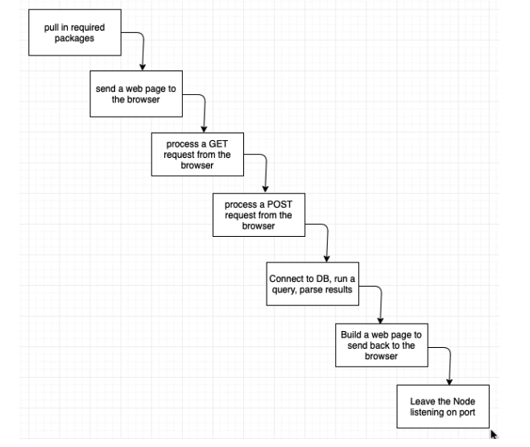

#software-development 

server-side scripting language that handles [[HTTP call]]s from the client

  

  

# Terminal

|Commmand | Meaning | Flag | Meaning |
|---|---|---|---|
| `node app.js` | start node app | `-v $(pwd):/folder` | bind current directory to folder in container|
| | | `-p port1:port2` | map port 1 of host to port 2 of container |

  

# Javascript Functions

| JS | Meaning |
|---|---|
|`url.parse`|parse out host, pathname, and variable values from a URL (i.e. [[GET request]])|
|`createServer(res, req)`|writes to the webpage, given `res` and `req` from [[HTTP call]]